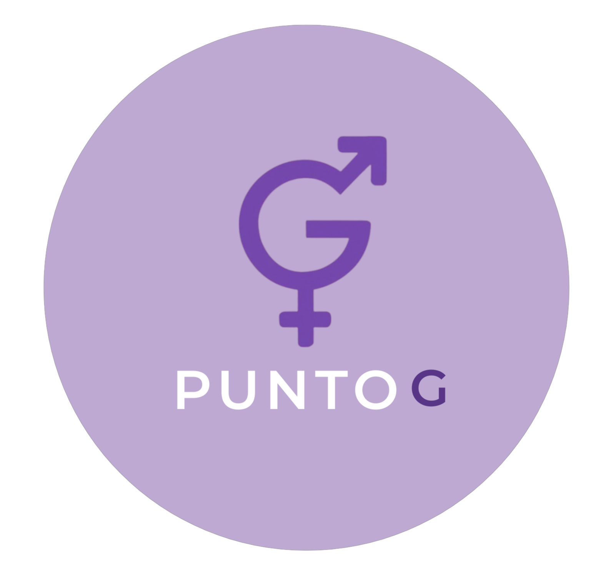

<p align="center">
  
</p>

<h1 align="center">Punto G 🌸</h1>
<p align="center"><em>A modern platform for sexual education events and workshops.</em></p>

## About

**Punto G** is an initiative to promote sexual education through engaging events, workshops, and community discussions. Our goal is to create a safe space for learning and dialogue around sexual health, consent, and empowerment.

## Features

- 📅 Event listings & registration
- 🎤 Expert-led workshops
- 🔒 Safe & inclusive environment
- 📚 Educational resources
- 💬 Community discussions

## Tech Stack  
**Built with Flutter for a seamless cross-platform experience:**  
- **Frontend**:  Flutter (Dart)  

## Getting Started

1. Clone the repository:
   ```bash
   git clone https://github.com/yourusername/f_project1_movil.git
2. Navigate into the project directory
   ```bash
   cd f_project1_movil
3. Install dependencies:  
   ```bash  
   flutter pub get
4. Run the App:  
   ```bash  
   flutter run
 
5. You are done! ✨


### Check out our app demo! 💮 https://www.youtube.com/shorts/lmBJjRMjMDU
### Learn how our app works! 🎥 https://www.youtube.com/shorts/dniOyBbtZEk
### Widget and Integration Testing ☑️ https://youtu.be/LZjIn6D4eE8?si=MUXkVi-YnfLNFc17
#### How the flutter app knows when theres has been an update on the backend and triggers the update? 🔗https://youtu.be/QZDc3_tft-A?si=YzIC9Og2_OzuTN9w
#### Observe the functionality of both apps  🎆 https://youtu.be/fFWO2N6fPK8


   
